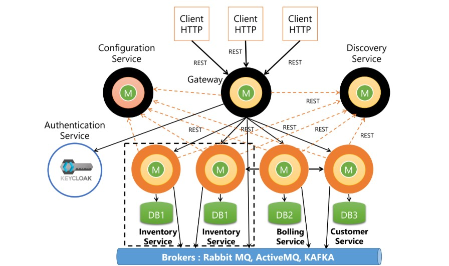
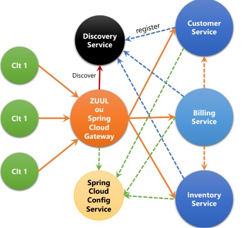
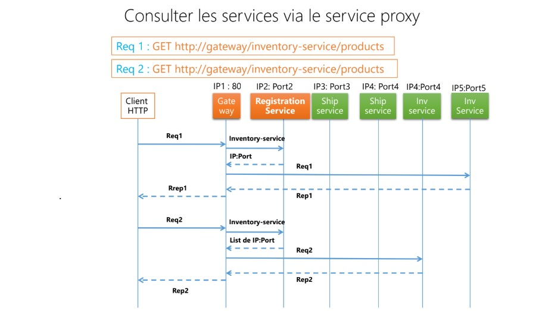
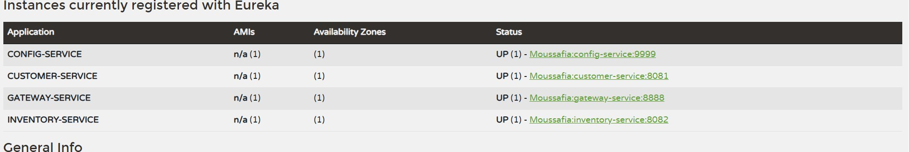

<h1>Architecture microservices – Spring Cloud</h1>

    <strong>Description :</strong> 
    Ce projet concerne une application de gestion des factures basée sur une architecture microservices.
    Elle contient trois microservices métiers :

<ul>
    <li><strong>Customer Service</strong> : gestion des clients.</li>
    <li><strong>Billing Service</strong> : gestion des paiements et communication avec les autres services.</li>
    <li><strong>Inventory Service</strong> : gestion des produits.</li>
</ul>

L’application contient également des services techniques :

<ul>
    <li><strong>Discovery Service</strong> : enregistre les microservices avec leur nom et adresse IP, les rendant découvrables.</li>
    <li><strong>Gateway</strong> : routage des requêtes et load balancing. Les clients envoient leurs requêtes au Gateway, qui consulte le Discovery Service pour transmettre la requête au microservice correct.</li>
</ul>

<strong>Configuration des services :</strong>

<ul>
    <li><strong>Configuration à froid</strong> : chaque microservice définit sa configuration individuellement, ce qui entraîne des répétitions.</li>
    <li><strong>Configuration à chaud</strong> : centralisation via un service de configuration.
        <ul>
            <li>Évite la répétition des configurations communes.</li>
            <li>Permet de modifier la configuration sans redémarrage des microservices.</li>
        </ul>
    </li>
</ul>

<h2>Diagramme Architecture microservices de gestion des factures</h2>

<h3>Architecture globale</h3>

<h3>Diagramme de transition</h3>

<h3>Interface Eureka</h3>

UI Eureka accessible via <a href="http://localhost:8761">http://localhost:8761</a> pour visualiser les services enregistrés.

<h2>Dépendances utilisées</h2>
<pre>
<!-- Client Eureka -->
<dependency>
    <groupId>org.springframework.cloud</groupId>
    <artifactId>spring-cloud-starter-netflix-eureka-client</artifactId>
</dependency>

<!-- Spring Cloud Gateway WebFlux -->
<dependency>
    <groupId>org.springframework.cloud</groupId>
    <artifactId>spring-cloud-starter-gateway-server-webflux</artifactId>
</dependency>

<!-- Actuator -->
<dependency>
    <groupId>org.springframework.boot</groupId>
    <artifactId>spring-boot-starter-actuator</artifactId>
</dependency>

<!-- Spring Data JPA -->
<dependency>
    <groupId>org.springframework.boot</groupId>
    <artifactId>spring-boot-starter-data-jpa</artifactId>
</dependency>

<!-- Spring Web -->
<dependency>
    <groupId>org.springframework.boot</groupId>
    <artifactId>spring-boot-starter-web</artifactId>
</dependency>

<!-- Spring Cloud Config -->
<dependency>
    <groupId>org.springframework.cloud</groupId>
    <artifactId>spring-cloud-starter-config</artifactId>
</dependency>

<!-- H2 Database -->
<dependency>
    <groupId>com.h2database</groupId>
    <artifactId>h2</artifactId>
    <scope>runtime</scope>
</dependency>

<!-- Lombok -->
<dependency>
    <groupId>org.projectlombok</groupId>
    <artifactId>lombok</artifactId>
    <optional>true</optional>
</dependency>

<!-- Config Server -->
<dependency>
    <groupId>org.springframework.cloud</groupId>
    <artifactId>spring-cloud-config-server</artifactId>
</dependency>

<!-- Eureka Server -->
<dependency>
    <groupId>org.springframework.cloud</groupId>
    <artifactId>spring-cloud-starter-netflix-eureka-server</artifactId>
</dependency>
</pre>

Ces dépendances permettent de créer une architecture microservices complète avec Spring Cloud,
incluant la découverte de services via Eureka, le routage et load balancing via Gateway,
la gestion centralisée des configurations, la supervision avec Actuator,
l’accès aux données avec JPA, le développement d’API REST et l’utilisation de bases de données embarquées avec H2.

<h2>Documentation utils</h2>

<h3>Rafraîchissement de la configuration</h3>

Envoyer une requête vers <strong>Actuator Refresh</strong> lors d’un changement de configuration :

<pre>
POST http://localhost:8081/actuator/refresh
Accept: application/json
</pre>

<h3>Consulter la configuration depuis le service de configuration</h3>

Permet de consulter les configurations selon l’environnement (default, dev, prod) :

<pre>
http://localhost:9999/application/env
env = default, dev, prod
</pre>

<h3>Accès aux services via Gateway</h3>

Contacter le Gateway (port 8888) pour accéder à un service enregistré dans le Discovery Service avec le nom <strong>CUSTOMER-SERVICE</strong> :

<pre>
http://localhost:8888/CUSTOMER-SERVICE/test-config1
</pre>

<h3>Configuration statique du Gateway (sans Discovery Service)</h3>
<pre>
spring:
  cloud:
    gateway:
      server:
        webflux:
          routes:
            - id: r1
              uri: http://localhost:8081
              predicates:
                - Path=/customers/**
            - id: r2
              uri: http://localhost:8082
              predicates:
                - Path=/products/**
</pre>

<h3>Configuration du Gateway avec Discovery Service</h3>

<strong>1ère méthode (YAML)</strong>

<pre>
spring:
  cloud:
    gateway:
      server:
        webflux:
          routes:
            - id: r1
              uri: lb://CUSTOMER-SERVICE
              predicates:
                - Path=/customers/**
            - id: r2
              uri: lb://CUSTOMER-SERVICE
              predicates:
                - Path=/products/**
</pre>

<strong>2ème méthode (Java)</strong>

<pre>
@Bean
RouteLocator routes(RouteLocatorBuilder builder) {
    return builder.routes()
        .route("r1", p -> p.path("/customers/**").uri("lb://CUSTOMER-SERVICE"))
        .route("r2", p -> p.path("/products/**").uri("lb://CUSTOMER-SERVICE"))
        .build();
}
</pre>

<h3>Configuration dynamique du Gateway</h3>
<pre>
@Bean
DiscoveryClientRouteDefinitionLocator discoveryClientRouteDefinitionLocator(
        ReactiveDiscoveryClient rdc,
        DiscoveryLocatorProperties dlp) {
    return new DiscoveryClientRouteDefinitionLocator(rdc, dlp);
}
</pre>

<h3>Activation / Désactivation du Discovery Service</h3>

Le Discovery Service est activé par défaut. Pour le désactiver :

<pre>
# spring.cloud.discovery.enabled=false
</pre>

<h3>Import de la configuration depuis le Config Server</h3>
<pre>
spring.config.import=optional:configserver:http://localhost:9999
</pre>

<h3>Enregistrement d’un microservice dans Eureka</h3>
<pre>
spring.cloud.discovery.enabled=true
</pre>

<h3>Actualisation dynamique des beans</h3>

Ce contrôleur sera réinstancié à chaque requête envoyée vers <code>/refresh</code>.

<pre>
@RefreshScope
</pre>

<h3>Configuration typée avec @ConfigurationProperties</h3>

Cette approche permet de mapper les propriétés de configuration dans une classe typée, facilitant l’accès et la validation des paramètres.

<pre>
@ConfigurationProperties(prefix = "customer.params")
public record CustomerConfigParams(int x, int y) {
}

@Autowired
private CustomerConfigParams customerConfigParams;

@GetMapping("customer-config")
public CustomerConfigParams getCustomerConfigParams() {
return customerConfigParams;
}
</pre>
<pre>
@SpringBootApplication
@EnableConfigServer
public class ConfigServiceApplication {
</pre>
